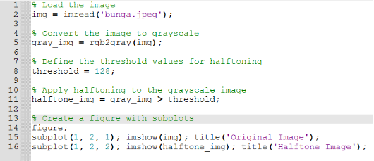

**PEMROSESAN CITRA DIGITAL**

**(ABKC6306)**

**“Halftoning: Patterning dan Dithering”**

**Oleh:**

Asmarani Ayudhia (2310131220002)

**Dosen Pengampu :**

Dr. Harja Santana Purba, M.Kom

Novan Alkaf Bahraini Saputra, S.Kom., M.T

**PROGRAM STUDI PENDIDIKAN KOMPUTER**

**FAKULTAS KEGURUAN DAN ILMU PENDIDIKAN**

**UNIVERSITAS LAMBUNG MANGKURAT**

**TAHUN** 

**2024**
**

# **DAFTAR ISI**

#
[DAFTAR ISI	ii****](#_toc178190635)**

[**PENDAHULUAN	1****](#_toc178190636)

[**PEMBAHASAN	2****](#_toc178190637)

[A.	Patterning	2](#_toc178190638)

[B.	Dithering	4](#_toc178190639)

[**DAFTAR PUSTAKA	7****](#_toc178190640)

#
2

# **PENDAHULUAN**
Citra digital adalah salah satu elemen penting dalam dunia multimedia yang digunakan untuk menyampaikan informasi secara visual. Salah satu teknik untuk meningkatkan kualitas citra digital adalah halftoning. Halftoning adalah proses generating pola biner oleh titik hitam dan putih dari sebuah gambar titik-titik hitam yang memiliki berbagai ukuran dan dikombinasikan, meskipun hanya mampu menampilkan warna hitam dan putih. Teknik ini sangat berguna dalam berbagai aplikasi, seperti pencetakan dan tampilan layar.

Ada dua metode utama dalam halftoning, yaitu patterning dan dithering. Patterning adalah teknik di mana setiap piksel pada gambar asli diganti dengan pola tertentu dari titik-titik hitam dan putih. Metode ini memungkinkan pembuatan gambar dengan gradasi warna meskipun perangkat memiliki kemampuan warna yang terbatas. Sementara itu, dithering adalah teknik yang menggunakan pola khusus untuk menentukan piksel mana yang harus berwarna hitam atau putih, sehingga dapat menciptakan ilusi gradasi warna yang lebih halus.

Patterning biasanya digunakan dalam situasi di mana pola titik-titik masih dapat diterima, seperti pada pencetakan surat kabar atau majalah. Sedangkan dithering lebih sering digunakan dalam tampilan digital, seperti pada layar komputer dan televisi, karena mampu menghasilkan gradasi warna yang lebih halus dan tampak lebih nyata.

Dengan memahami dan menerapkan kedua teknik ini, kita bisa meningkatkan kualitas tampilan citra digital, sehingga gambar yang dihasilkan terlihat lebih jelas dan menarik, serta dapat menyampaikan informasi visual dengan lebih baik..

# **PEMBAHASAN**

1. ## **Patterning**
Patterning adalah metode halftoning di mana setiap piksel gambar asli digantikan dengan pola yang mewakili intensitas warna piksel tersebut. Teknik ini bekerja dengan mengonversi nilai intensitas grayscale (0 hingga 255) menjadi pola titik hitam dan putih. Semakin tinggi nilai intensitas (semakin mendekati 255), semakin banyak titik putih yang digunakan dalam pola tersebut. Sebaliknya, semakin rendah nilai intensitas (semakin mendekati 0), semakin banyak titik hitam yang muncul.

Contoh: Misalkan kita memiliki gambar 8-bit grayscale, berarti terdapat 256 tingkat intensitas (0–255). Jika kita menggunakan pola 3x3, maka satu piksel akan diubah menjadi matriks 3x3 biner (total 9 piksel). Pola ini dapat menghasilkan berbagai tingkat keabuan sesuai dengan intensitas piksel aslinya. Semakin kompleks pola titik yang digunakan, semakin halus gradasi yang bisa dihasilkan.

Langkah-langkah patterning:

- Representasi Warna. ada 256 warna (0-255), yang dibagi menjadi 10 kategori atau range, yaitu masing-masing mewakili 26 warna.
- Setiap angka (0-9) dalam rentang tersebut memiliki pola tersendiri. Pola ini digunakan untuk mengonversi satu piksel menjadi blok 3x3 piksel.

Contoh Perhitungan: Angka-angka seperti 129, 170, 200, dan 45 diubah ke dalam rentang angka 0-9 sesuai dengan kelompok warnanya. Setelah itu, angka tersebut direpresentasikan sebagai pola 3x3 piksel yang lebih besar.

Rentang = nilai intensitas ÷ 26

Perhitungan:

129 ÷ 26 ≈ 4.96(floor 4)

170 ÷ 26 ≈ 6.54 (floor 6)

200 ÷ 26 ≈ 7.69 (floor 7)

45 ÷ 26 ≈ 1.73 (floor 1)

Rentang Hasil:

129: 4

170: 6

200: 7

45: 1

1. ## **Dithering**
Dithering adalah teknik halftoning di mana setiap piksel gambar grayscale dibandingkan dengan nilai ambang batas (threshold) yang ada pada matriks dither. Matriks dither berisi nilai-nilai tetap yang digunakan untuk menentukan apakah suatu piksel akan diubah menjadi hitam atau putih.

Langkah-langkah dithering:

- Setiap nilai piksel grayscale dibandingkan dengan nilai yang sesuai dari matriks dithering 
- Jika nilai piksel grayscale lebih kecil atau sama dengan nilai matriks pada posisi tersebut, piksel akan diubah menjadi hitam (0).
- Jika nilainya lebih besar dari nilai matriks, piksel akan diubah menjadi putih (1).

Matriks Dither: [0, 128]

`		 `[64, 224]

[70, 120]

[180, 240]

Iterasi Melalui Setiap Piksel

- Piksel (0,0): Nilai 70

  Matriks Dither: 0 (posisi [0,0])

  Bandingkan: 70 > 0 → Set menjadi putih (1)

- Piksel (0,1): Nilai 120

  Matriks Dither: 128 (posisi [0,1])

  Bandingkan: 120 ≤ 128 → Set menjadi hitam (0)

- Piksel (1,0): Nilai 180

  Matriks Dither: 64 (posisi [1,0])

  Bandingkan: 180 > 64 → Set menjadi putih (1)

- Piksel (1,1): Nilai 240

  Matriks Dither: 224 (posisi [1,1])

  Bandingkan: 240 > 224 → Set menjadi putih (1)

  
# **DAFTAR PUSTAKA**
#
` `Foley, J. D., van Dam, A., Feiner, S. K., & Hughes, J. F. (1996). *Computer Graphics: Principles and Practice*. Addison-Wesley.

Gonzalez, R. C., & Woods, R. E. (2008). *Digital Image Processing (3rd ed.)*. Pearson Prentice Hall.

` `Pappas, T. N., & Neuhoff, D. L. (2000*). Least-Squares Model-Based Halftoning*. IEEE Transactions on Image Processing, 9(6), 1001-1016.

Pitas, I. (2000). *Digital Image Processing Algorithms and Applications*. John Wiley & Sons.

Ulichney, R. (1987). *Digital Halftoning*. MIT Press.

